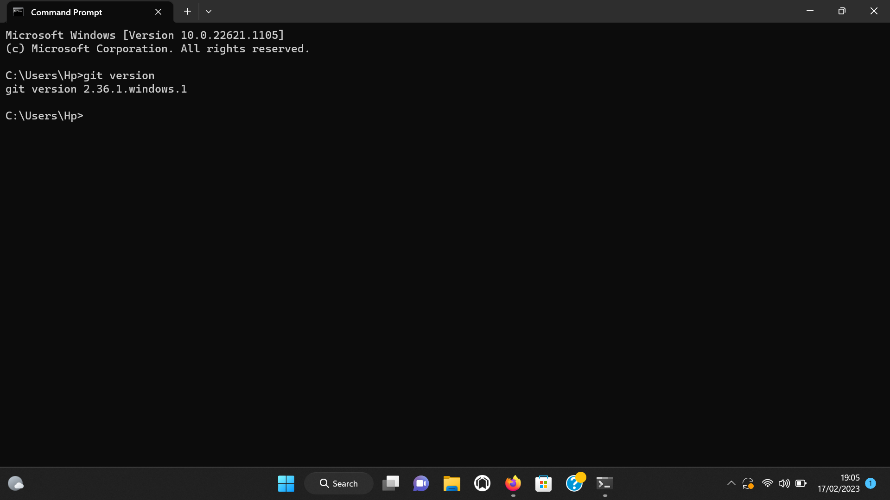

# Instalasi Git

[ [<< Kembali](README.md) ]

Bagian ini merupakan seri tulisan tentang [Git](https://git-scm.com/). Silahkan ke [README.md](README.md) untuk memahami gambaran garis besar materi-materi yang dituliskan.

Git tersedia untuk berbagai sistem operasi. *Precompiled binaries* bisa diperoleh di [halaman dowbload Git](https://git-scm.com/downloads) untuk 3 sistem operasi utama: Linux, Mac OS X, dan Windows. Git bisa menggunakan antarmuka grafis (GUI) maupun CLI (*command line interface*). Pada materi ini, kita akan banyak menggunakan antarmuka CLI melalui shell (Linux / Mac OS X) atau *command prompt* / PowerShell di Windows. Setelah instalasi, periksa keberhasilan instalasi dengan menggunakan:

```
$ git --version
git version 2.19.2
```

## Instalasi pada Windows

Sebelum install Git di Windows, anda harus sudah mempunyai editor teks yang didukung oleh Windws. Editor yang bisa dipilih banyak, tetapi disarankan menggunakan [Notepad++](https://notepad-plus-plus.org/) atau [Visual Studion Code](https://code.visualstudio.com/) atau [Vim](https://www.vim.org/). Keberadaan editor teks ini akan menentukan keberhasilan instalasi (lihat langkah 5).

1. Setelah download Git, double click pada file yang di-download. Akan dimunculkan lisensi. Klik **Next** untuk lanjut.
2. Setelah itu, pilih lokasi instalasi. Secara default akan terisi *C:\Program Files\Git*. Ganti lokasi jika memang anda menginginkan lokasi lain, klik **Next**
3. Pilih komponen. Tidak perlu diubah-ubah, sesuai dengan default saja. Klik pada **Next**.
4. Mengisi shortcut untuk menu Start. Gunakan default (Git), ganti jika ingin mengganti - misalnya Git VCS.
5. Pilih editor yang akan digunakan bersama dengan Git. Pada pilihan ini, digunakan Notepad++.
6. Pada saat instalasi, Git menyediakan akses git melalui Bash maupun command prompt. Pilih pilihan kedua supaya bisa menggunakan dari dua antarmuka tersebut. Bash adalah shell di Linux. Dengan menggunakan bash di Windows, pekerjaan di command line Windows bisa dilakukan menggunakan bash - termasuk ekskusi dari Git.
7. Pilih OpenSSL untuk HTTPS. Git menggunakan https untuk akes ke repo GitHub atau repo-repo lain (GitLab, Assembla).
8. Pilih pilihan pertama untuk konversi akhir baris (CR-LF).
9. Pilih PuTTY untuk terminal yang digunakan untuk mengakses Git Bash.
10. Untuk opsi ekstra, pilih serta aktifkan 1 dan 2.
11. Setelah itu proses instalasi akan dilakukan.
12. Jika selesai akan muncul dialog pemberitahuan. Klik pada **Finish**.
13. Untuk menjalankan, dari Start menu, ketikkan "Git", akan muncul beberapa pilihan. Pilih "Git Bash" atau "Git GUI".
14. Tampilan jika akan menggunakan "Git Bash"
15. Tampilan jika akan menggunakan "Git GUI"
16. Untuk mencoba dari command prompt, masuk ke command prompt, setelah itu eksekusi "git --version" untuk melihat apakah sudah terinstall atau belum. Jika sudah terinstall dengan benar, makan akan muncul hasil berikut:

